# NiceStart


## Splash

*[Gradient](app/src/main/res/drawable/gradient.xml)

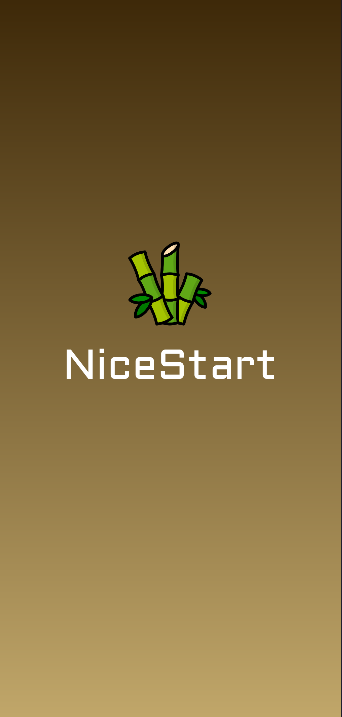 

### Splash Animation (Zoom)

* [Animations](app/src/main/res/anim)
* All animations are [implementates in this java file](app/src/main/java/com/aperez/nicestart/Splash.java)
```Java
ImageView logosplash = findViewById(R.id.logosplash);
Animation myanim = AnimationUtils.loadAnimation(this, R.anim.logo);
        logosplash.startAnimation(myanim);

ConstraintLayout fondosplash = findViewById(R.id.main);
Animation myanim1 = AnimationUtils.loadAnimation(this, R.anim.fondo);
        fondosplash.startAnimation(myanim1);

TextView nicestartsplash = findViewById(R.id.textView2);
Animation myanim2 = AnimationUtils.loadAnimation(this, R.anim.nicestart);
        nicestartsplash.startAnimation(myanim2);

ConstraintLayout layout = findViewById(R.id.lay);
Animation myanim3 = AnimationUtils.loadAnimation(this, R.anim.ampliacion);
        layout.startAnimation(myanim3);
```

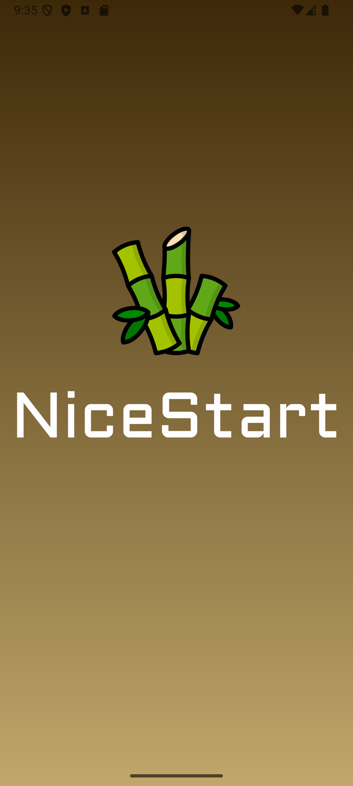 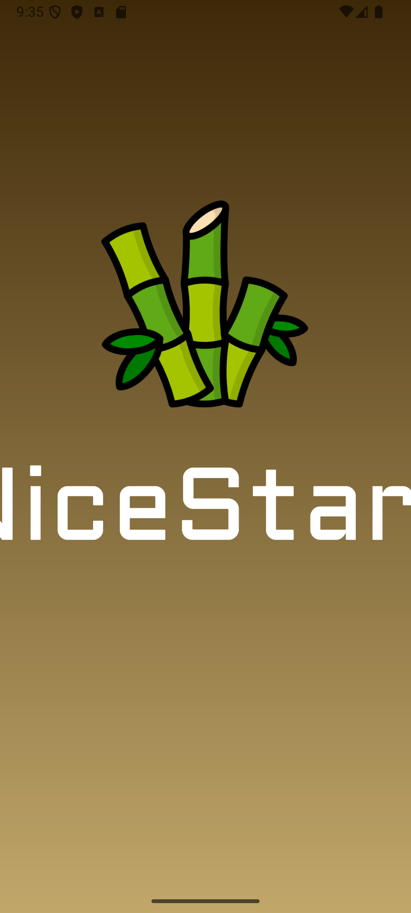  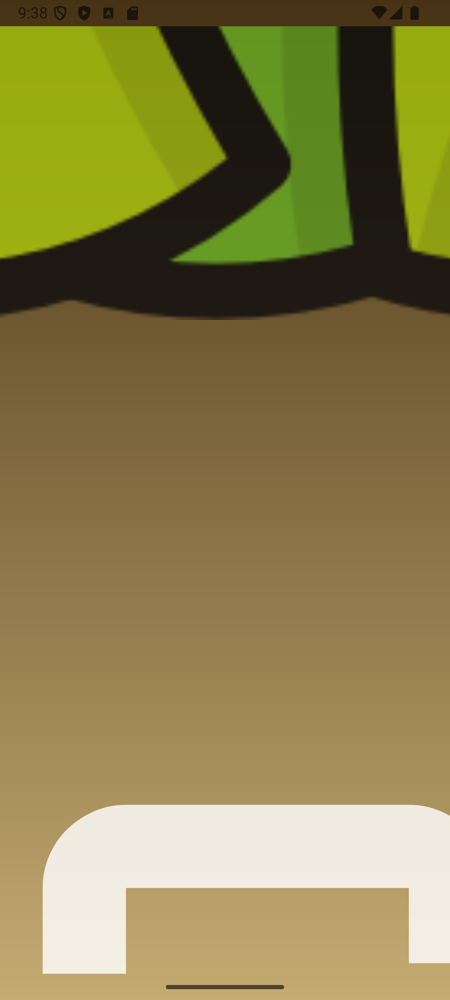
<div align="center">
    
</div>


## Login

* [Design](app/src/main/res/layout/activity_login.xml)
* [Buttons Style](app/src/main/res/values/styles.xml)
* [Colors](app/src/main/res/values/colors.xml)

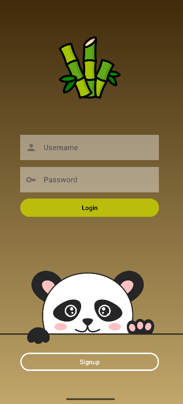

### Login Horizontal View

* [Design](app/src/main/res/layout-land/activity_login.xml)

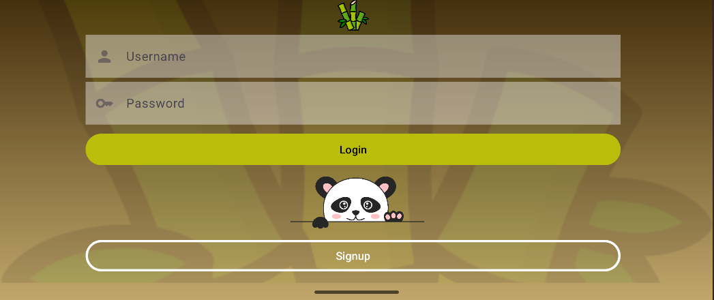


## Signup

* [Design](app/src/main/res/layout/activity_signup.xml)

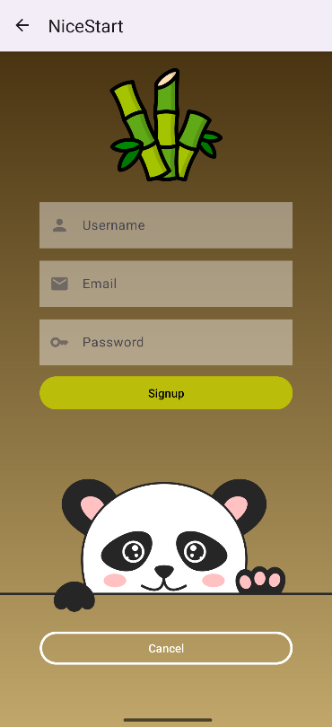

### Signup Horizontal View

* [Design](app/src/main/res/layout/activity_signup.xml)

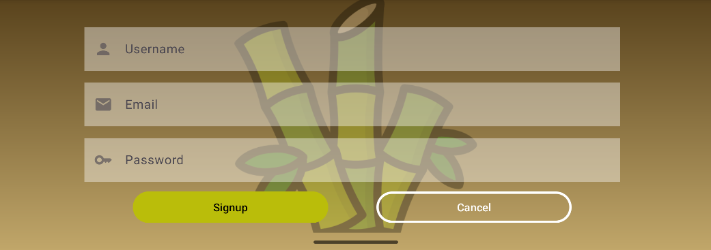

## MainView

* [MainView Java](app/src/main/java/com/aperez/nicestart/Main.java)
* [MainView XML](app/src/main/res/layout/activity_main.xml) (WebView)


### SwipeRefresh (WebView)

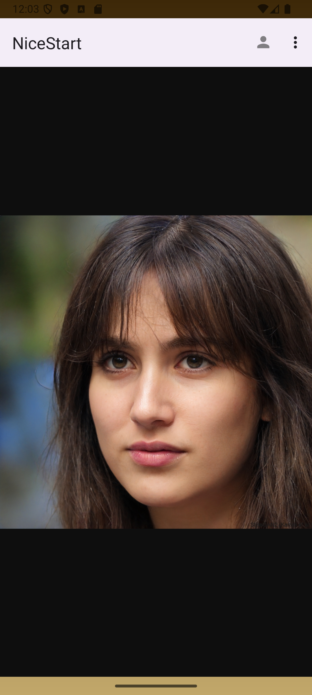 


### ContextMenu

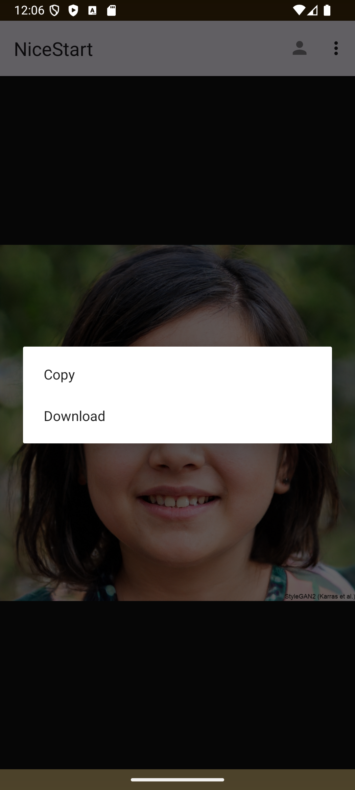

### AppbarMenu

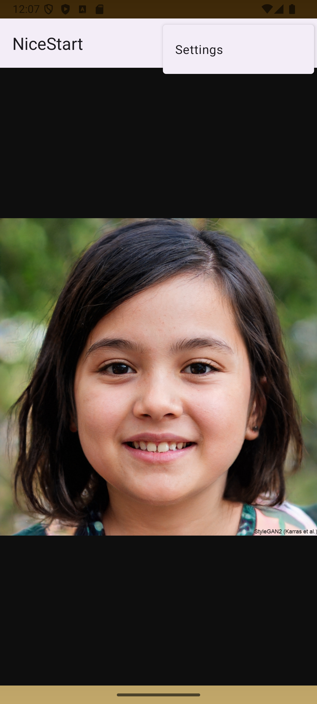

* Snackbar

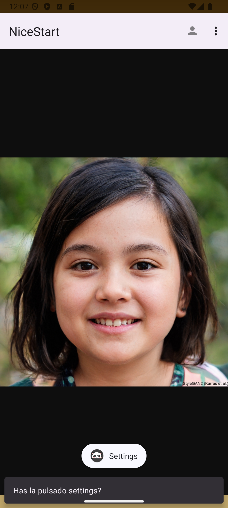

```Java
final ConstraintLayout mLayout = findViewById(R.id.main);

Snackbar snackbar = Snackbar
        .make(mLayout, "Has la pulsado settings?", Snackbar.LENGTH_LONG);
//                .setAction("UNDO", new View.OnClickListener() {
//                    @Override
//                    public void onClick(View view) {
//                        Snackbar snackbar1 = Snackbar.make(mLayout, "Action is restored!", Snackbar.LENGTH_SHORT);
//                        snackbar1.show();
//                    }
//                });

            snackbar.show();
```

### UserIcon

* [AlertDialog Layout](app/src/main/res/layout/alertdialog_view.xml)

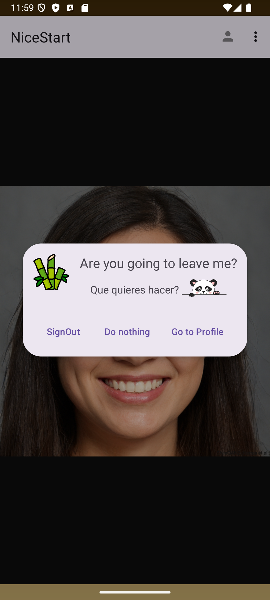

## Profile

* [MainView Java](app/src/main/java/com/aperez/nicestart/Profile.java)
* [MainView XML](app/src/main/res/layout/activity_profile.xml)

&nbsp;&nbsp;&nbsp;&nbsp;&nbsp;&nbsp;&nbsp;

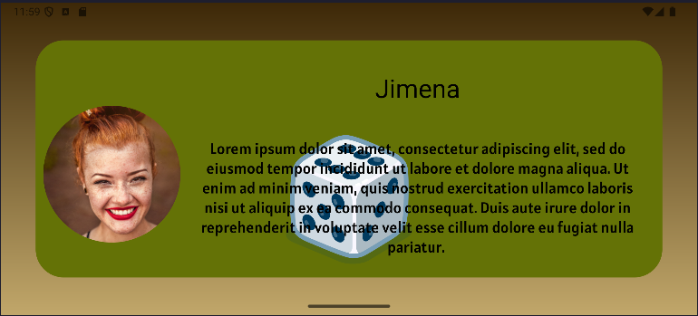

### LottieAnimations

* [Animation](app/src/main/res/raw/dados.json)
* XML LotieAnimation Code
```Java
<com.airbnb.lottie.LottieAnimationView
    android:layout_width="wrap_content"
    android:layout_height="wrap_content"

    app:lottie_rawRes="@raw/dados"
    app:lottie_autoPlay="true"
    app:lottie_loop="true"

    app:layout_constraintTop_toTopOf="parent"
    app:layout_constraintEnd_toEndOf="parent"
    app:layout_constraintBottom_toBottomOf="parent"
    app:layout_constraintStart_toStartOf="parent"/>
```


